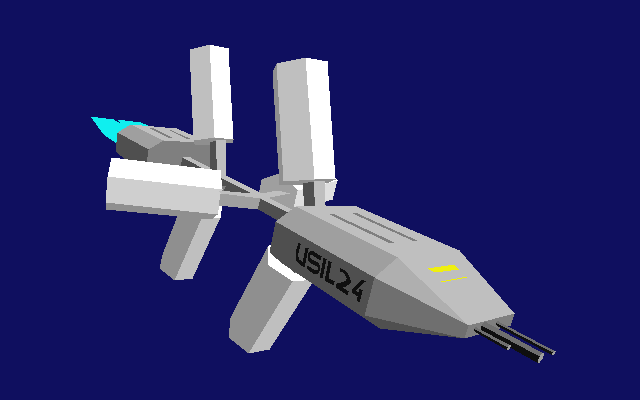
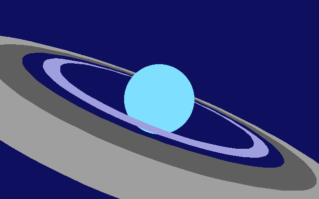

# Frontier: Elite 2 - Graphics Study

[Web Demo](fe2-intro.html)  [Source](https://github.com/watsonmw/fe2-intro)

## Introduction

[Frontier: Elite 2](https://en.wikipedia.org/wiki/Frontier:_Elite_II) (FE2) was released in late 1993 on the Amiga by
[David Braben](https://en.wikipedia.org/wiki/David_Braben).  The game was an ambitious spaceship sim / open galaxy
sandbox, squeezed into a single floppy disk.  You could launch your ship from a space station, jump to another star
system, travel to a distant planet, land and dock at the local spaceport, fighting pirates and avoiding police along the
way.  Each planet had its own atmosphere, rendered differently based on the type.  Moons, planets and stars moved across
the sky.  Any planet in a system could be visited.  Any star system in the galaxy could be jumped to.  You could even 
use gravity to slingshot your ship around stars and planets.

Before playing the game, I got ahold of a demo disk that was just the intro sequence playing in a loop.   I must
have watched the game intro 10s of times.  The intro had a kicking classical soundtrack and impressive visuals for
an Amiga game.  It hinted at the huge and complex galaxy simulation.  Screenshots of the game in magazines also
looked gorgeous (well for the time!), futuristic cities framed with alien skies, planets and moons moving across the
sky.   How was it all done?  Due to the scope and variety of shapes in the scenes, I was a bit bamboozled really.  I had
somehow come across the basics of 3D projection, and it was small step to figure out lines and maybe filled
triangles from there, but I ultimately ended up with more questions than answers.  And - as is often the case when
you haven't seriously got into solving a problem yet - I had the wrong questions to begin with!

The Frontier 3D engine was tailored for rendering planets, moons, stars, spaceships and habitats on an Amiga.
Here are some notable features of the Frontier 3D engine:

- Planetary atmospheres &amp; surface details
- Star System lighting &amp; shading with dynamic palette
- Curved polygons / surfaces
- 3D text
- Engine plume / trails
- Lens flair effects
- Lines and detailing
- Level of Detail (LOD) based on distance
- Huge variety of star / planet / ship / city / starport models

## Target Platform

The original Amiga was based on the [Motorola 68000](https://en.wikipedia.org/wiki/Motorola_68000) 16-bit 7MHz CPU, and
this was the base CPU that was targeted.  At that time the 68K CPU was pretty commonly used, other home computers
using it were the AtariST and Mac.  An AtariST version was released at the same time as the Amiga version. 

The resolution targeted was 320 x 200 with up to 16 colours on-screen at any one time.  The colour palette was from a
possible 4096 colours. The 16 colours were assigned via a 12-bit RGB format: 4 for Red, 4 for Green, 4 for Blue. The 3D
scene was rendered in the top 168 rows, the ship cockpit / controls were displayed in the bottom 32 rows (or the case of
the intro - the Frontier logo).

The base Amiga could support a 32 colours palette, but the AtariST was limited to 16 colours so the engine has to work
with just 16 colours available.  This may be why the Amiga version is limited to 16 colours as well.

The Amiga has a co-processor called the [Blitter](http://amigadev.elowar.com/read/ADCD_2.1/Hardware_Manual_guide/node0119.html),
capable of drawing lines and filling spans (i.e. polygons), but FE2 only used it to clear the screen, not for filling
polygons.  The Blitter was best suited to working in parallel with the CPU and doing a few large operations, to make use
of the available memory bandwidth.  But it was tricky to use for rendering polygons, due to the multi-step process of
1) drawing lines to a temp buffer, 2) span filling the temp buffer, and 3) compositing that to the screen buffer for
each polygon.  Each new operation in this process would have to be feed either by via an interrupt or from a
[Copper](http://amigadev.elowar.com/read/ADCD_2.1/Hardware_Manual_guide/node0047.html) list - for small polygons this
would not have been worth it.  This is probably why the CPU was used as the rasteriser - partly due to having to write
CPU rasteriser code for the AtariST anyway and the marginal, if any, performance return on using the Blitter.  See: 
[StackExchange - Why Amiga Blitter was not faster than AtariST for 3D](https://retrocomputing.stackexchange.com/questions/7626/why-were-3D-games-on-the-amiga-not-faster-than-on-similar-16-bit-systems-like-th)

The PC version came slightly later, and has a few additions over the Amiga version.  It was translated to x86 assembly
from the 68K assembly by [Chris Sawyer](https://en.wikipedia.org/wiki/Chris_Sawyer).  PCs were starting to get a lot
more powerful at the time, and FE2 on the PC made good use of the extra horsepower available.  The additions are listed
[below](#pc-differences).

## Models

Each star / planet / ship / city / starport / building / etc model is represented as a series of opcodes.  These are
executed every frame to build a raster list.   There are approximately 32 opcodes.  The first few opcodes
specify a primitive to render, e.g. a circle, line, triangle, quad, or polygon.  These primitives are transformed,
projected and clipped before being stored in a raster list, where they will be drawn later.

There are instructions to do matrix setup, scaling, and rotations.  And also instructions for conditional logic, branches
and calculations.  These are used many creative purposes, chiefly:

- Distance based Level of Detail (LOD)
- Model Variety (Colours, conditional rendering)
- Animations (Landing gear, docking, explosions)

Other instructions render entire 3D models:

- Planets / Stars
- Spheres
- Cylinders (e.g. Landing gear wheels, courier engines, railings)
- Other models (in given reference frame)
- 3D text strings

## Per Frame Breakdown

On the Amiga, screen clears are done using the [Blitter](http://amigadev.elowar.com/read/ADCD_2.1/Hardware_Manual_guide/node0119.html).
This happens in the background while the game gets on with updating game logic and deciding what models to render.  The 
models are then rendered, and a raster list consisting of triangles, quads, lines, circles, etc is built.  The raster
list is stored as a binary tree sorted by z-depth.  Once all models are done adding items to the raster list, the game
checks that the Blitter is done clearing the screen's backbuffer (which it normally is by this point).  Then everything
is rendered back to front by traversing the binary tree.

- Kick off a screen clear of back buffer using the Blitter (double buffering)
- Run game update logic, building list of model instances to render
- Iterate through model instances:
    - If bounding sphere is outside viewport, skip
    - Run model code, building the 2D raster list 
- Once raster list is complete, look at colours used and build a palette
- Wait for Blitter clear to be done
- Update the palette if any colours changed
- Raster graphics back to front
- Flip back buffer and front buffer

Sidenote: I got a comment about triple buffering the output to get higher FPS.  I guess the implication
being that while the CPU is waiting around for a vertical blank to display the next frame, it could be doing real
work on a future frame.  I'm sure that could be exploited in some scenarios, but normally with this scheme you are
increasing the frame rate at the expense of latency, and latency issues are normally why you want to increase the frame
rate in the first place.  This technique is more applicable when the graphics are non-interactive or an extra frame of
latency just doesn't matter that much (but keep in mind, some people are more sensitive to input latency than others!). 

## Raster List

The raster list is organised as a binary tree keyed off a depth (z distance) per raster item.  The depth of any given
raster item is typically given by one of its vertices, or min / max of all its vertices.  The model code has wide
control over which method is used.

The binary tree can contain **batch** nodes, these contain a list of raster items all at the same depth (making
insertions after the first item in the batch a simple append).  This enforces a raster order for a list of items, that
is independent of the view direction / object rotation.  Typically, this is used to add extra detail to a polygon
without the raster items z fighting.  With a modern renderer you would disable the depth test, or bake into a texture /
shader.

Another interesting thing is the model code can add sub-tree nodes with their own internal sorting.  The whole sub-tree
has one z-depth in the outer tree, and any nodes added to the raster list while this sub-tree is active only get added
to the sub-tree.  This includes depth values that would otherwise be sorted in front of, or behind objects in the outer
tree.  Frequently used for landing gear, so you don't get any part of the landing gear poking through the main ship
model / wing.

## Lighting

Lighting in-game is directional and coloured from the main star.  Each object rendered can have its light source
direction & colour setup independently, so that the direction is correct for each model when the star is placed in the
middle of scene, e.g. orrery view or viewing a distant planet.

In the intro and ship view screen the light source is fixed and came from the top-right of the screen, i.e. above the
subject and to the side, much like in film.

In most places where a colour is specified, two special bits of the colour are used to indicate how lighting should be
applied.

The 12-bit colour format expected by the HW is as follows:
    
      | Colour | Red  | Green | Blue |
      | Bits   | ba98 | 7654  | 3210 |
    
But in FE2 when a colour is specified, one bit from each colour has a special meaning:
    
- Bit 8 - If set emit colour directly / don't add normal colour
- Bit 4 - Add the scene base colour (sometimes diffuse, sometimes just object instance colour)
- Bit 0 - This bit is not used, typically the model OpCode borrows this bit
    
So the colour per bit layout is as follows instead:
    
      | Red | !Shade | Green | Add Global Colour | Blue | Unused |
      | ba9 | 8      | 765   | 4                 | 321  | 0      |

The computed normal colour (directional light from the star) and global (diffuse) are added directly to the base colour.
Since the object colour can only be specified at half intensity, the rest of the colour contribution comes from the
global diffuse colour and / or the normal colours.

The set of normal colours to add are setup with each new reference frame (either copied form the parent model, or passed
in from the code that started rendering the model).

The normal colours and global colour could be overridden by the model code for sub-models, this allowed for additional
lights in the scene (albeit one at a time).  E.g. hazard lights on space stations and ground control.

## Matrix Setup

Rotations were done with a 3x3 fixed point matrix.  Since with rotation matrices all the values of the matrix are
between -1 and 1, each value could be represented as a signed 16-bit integer implicitly divided by 0x8000, i.e. 0x8000
is -1 and 0x7FFF is ~1.

A scale is built into each model & object, and applied directly on the vertices using bit shifts (the shifting can be
cancelled out if needed, say you are rendering an extremely large object from far away).

Offsets / translations are done with separate 3D vectors, and rotated as needed.

When projecting vertices:

- First the vertex is unpacked
- Second, it is rotated to view space using the current 3x3 rotation matrix
- Third, it is scaled with the current object scale (by bit shifting)
- Forth, it is offset by the current view space object vector
- Finally, it is 3d projected onto the screen (using bit shifts and a depth lookup table (the perspective depth division)) 

It should be noted this is done lazily on a per-vertex basis, as the vertex is requested by the model code.  This is
because A) not all vertices are rendered, since the model code contains conditionals and B) vertices can be dynamically
positioned by model code.

## Scale and Numeric Precision

The 68K processor could only do 16-bit multiplies and divides, and each took many cycles to complete
(MULS - Multiply Signed: took 70 cycles, DIVS - Divide Signed - took a whooping 158 cycles, compare this to add /
subtract which took around 6 cycles). Hardware supported floating point is very rare as it required an upgraded or
expensive Amiga.  Not much software supported HW floating point and for real time 3D it often wasn't faster than a
fixed point scheme anyway (as much of the precision is unneeded / can be worked around).  Anyway, end result,
the Frontier engine implemented its own fixed point & floating point code using integer instructions.

There are two schemes used (in the renderer):

- Fixed point with a variable for the current scale.  This is used by the majority of model code, for transforming
  vertices and normals, and doing any calculations needed.
- Full software based floating point.  This is used by the planet renderer.

There are lookup tables & supporting code for many operations:

- Perspective divide (with near clipping built-in to lookup data)
- Sine and cosine
- Square root for calculating distance / vector length
- Arctan

Two software floating point number sizes are supported:

- 32-bit: 15 bits for mantissa (factional part), 16 bits for exponent (embiginess part), 1 bit sign
- 48-bit: 31 bits for mantissa, 16 bits for exponent, 1 bit sign

Note that's a lot of bits for the exponent allowing for some very large numbers (that's not 15 bit shifts, its **32K bit
shifts**!).  This is mainly due to it being easier this way since it is implemented with 16-bit integer math primitives.
Compare the exponent size to IEEE floating point 754, which used only 11 bits for the exponent in 64-bit floating point!

## Palette Fitting

Two separate palettes are used, one for the 3D area (top 168 rows) and one for the ship cockpit UI (bottom 32 rows),
each with 16 colours.  The palette is adjusted by a vertical blank interrupt (for the top part) and a copper interrupt
(for the bottom part).  Note that this is done based on the beam position, so it is independent of the 3D frame render
loop, at a constant 50 times per second.

The colour space is 12-bit for a total of 4096 colours, but only 16 of these can be used at any one time.  A clever
scheme is used to get the most of out of these 16 colours.  A virtual palette with space for up to 62 colours is created.
As new colours are requested by the renderer, they are recorded in the virtual palette.  Items added to the draw list
reference these virtual colour indexes.  Later these will be resolved to real HW palette entries.  An array of 4096
slots is used to keep track of which virtual colours are used so far in a frame (it stores a virtual index or 0 for
unassigned slots).

If there are less than 15 colours, then we are done - the virtual colours can be assigned to the palette directly (It's
15 because 1 colour out of the 16 is the background colour, and this is never grouped with another colour).

If we've more than 15 colours, well, now some magic needs to happen!  The virtual colours need to be merged to fix into
the 15 available palette entries.  This is done by recursively splitting / partitioning the assigned virtual colours
into 15 buckets (sort of like quicksort but for clustering, if you know the name of this clustering algorithm let me
know!).  Each partition splits based on the largest color component difference.  So, for example, if there is bigger red
range (than blue or green) in the sublist of virtual colours, the red midpoint is used to partition the sublist.  This
is done repeatedly - recursively splitting the virtual colours into ranges until we've 15 total ranges.  The size of
each range at this point is variable, a range can have 1 colour or in the absolute worst case ~48 (62-14) colours in a
given range.  But, normally there will be a small number of colours in the range, e.g. 1, 2 or 3 colours.  At the end of
this process, each range is resolved to a single colour by picking the colour in the midpoint of the range (by each
colour component).  Finally, these colours are stored to be picked up later by the HW on the next double buffer swap.

I should note the PC version doesn't use this colour matching scheme, it has more colour palette entries available than
even the virtual colour list on the Amiga, so it rarely needs to do any colour merging / palette compression at all.
This is the version I've implemented.

## Planet Rendering

The planet renderer is very special, it has its own raster list primitives, uses its own floating point number scheme,
and is mostly custom code vs being rendered using existing model opcodes.

There are three types of surface features:

- Surface polygons - Land masses on earth-likes, or colour bands on jupiter-likes
- Surface circles - Polar ice caps
- Shading in the form of 1 - 3 great arcs (these typically cut across the other surface features)

The surface polygons are mapped to the surface of the planet by treating them as arcs across the surface.  Procedural
sub-division of the surface polygon line segments are used to add surface detail as you get closer to the planet.

A set of atmospheric colours can be specified, these are rendered when looking at a planet / star side on.

Which brings us to the view dependant rendering paths:

- When the planet covers most of the screen the background colour is changed to the surface colour to avoid overdraw.
- When the planet is at the edge of the screen, or you were viewing along the surface, the outline is rendered with a
  single Bézier curve.  Any atmospheric bands are rendered with additional Bézier curves.
- When the planet outline is elliptical, it is rendered with two Bézier curves.

When it comes to rasterising the planet, a custom multi-colour span renderer is used.  The renderer generates an
outline of the planet, then adds surface details, and finally great arcs for shading were applied on top. This generated
a set of colour flips / colour changes per span line within an overall outline, which were sent to the rasteriser.

Planets rings are implemented in model code, using the complex polygon span renderer (Bézier curves strike again!).

How are weather pattern effects done? You guessed it!  Using Bézier curves & the complex polygon span renderer.

Ditto for craters on moons / smaller planets.

## Model Data

Each model in the game has the same basic model structure:

- Code offset, #vertices, #normals
- Scale and bounding sphere
- Base colour
- List of vertices
- List of normals
- Model OpCodes to be executed by a render VM per frame

### Example Model

Here's an example model, you'll learn about the details in the following sections.

    ; Single polygon heart logo
    ; Commented lines start with ;
    ; Actual compiled words are commented on right
    model: 3                      ;   0032 - codeOffset
      scale1: 16,                 ;   001e - vertexDataOffset
      scale2: 0,                  ;   0100 - verticesDataSize
      radius: 40,                 ;   002e - normalsOffset
      colour: #04c                ;   0008 - normalDataSize
                                  ;   0010 - scale
                                  ;   0000 - unknown
                                  ;   0028 - radius
                                  ;   0000 - unknown
                                  ;   004c - colour
                                  ;   0000:0000:0000:0000:0000 - unknown

    vertices: ; 4                 ;
      0, -15, 0                   ;   0100:f100 - v. index 0
      0, 30, 0                    ;   0100:1e00 - v. index 2
      25, -35, 0                  ;   0119:dd00 - v. index 4
      45, -13, 0                  ;   012d:f300 - v. index 6
    
    normals: ; 1
      0 (0, 0, -127)              ;   0000:0081 - n. index 2
    
    code:
      complex normal:2 colour:#800 loc:00010
      cbezier 0, 4, 6, 2
      cbezierc 7, 5, 0
      cdone ; 8005:0c02:0200:0004:0602:0807:0500:0000
      00010: done ; 0000

### Vertex Encoding

Each vertex is specified in 32 bits:

- 1 byte for vertex type
- 1 byte signed int for X
- 1 byte signed int for Y
- 1 byte signed int for Z

The vertex type controls how the vertex is computed and projected.  Even though I said the last 3 bytes of a vertex
were the (X, Y, Z) values, this is not true for all vertex types.  For some types these values are references to other
vertices, or even model code registers.  The different vertex types are:

|Hex#| Vertex Type |Params|Description|
|----|-------------|------|-----------|
| 00, 01, 02|Regular|X, Y, Z|Regular vertex with X, Y, Z directly specified|
| 03, 04|Screenspace Average|Vertex Index 1, Vertex Index 2|Take screenspace average of two other vertices|
| 05, 06|Negative|Vertex Index|Negative of another vertex|
| 07, 08|Random|Vertex Index, Scale|Add random vector of given size to vertex|
| 09, 0A|Regular|X, Y, Z|Regular vertex with X,Y,Z directly specified|
| 0B, 0C|Average|Vertex Index 1, Vertex Index 2|Average of two vertices|
| 0D, 0E|Screenspace Average|Vertex Index 1, Vertex Index 2|Take screenspace average of two other vertices, but don't project sibling vertex|
| 0F, 10|AddSub|Vertex Index 1, Vertex Index 2, Vertex Index 3|Add two vertices, subtract a 3rd|
| 11, 12|Add|Vertex Index 1, Vertex Index 2|Add two vertices|
| 13, 14|Lerp|Vertex Index 1, Vertex Index 2, Register|Lerp of two vertices, as specified by model code register|

When vertices are referenced by model code, negative numbers reference vertices in the parent model.  Indexes are
multiplied by 2, with even numbered indexes referencing vertexes specified in the current model as is, and odd numbers
referencing the same vertices but with the x-axis sign flipped.

The parent model can choose what (0-4) vertices to export to sub-models, this is done as part of the 'MODEL' opcode.

A vertex index in model code is stored as 8-bits, with only positive vertices from the current model, and a bit for 
flipping the x-axis, this resulted in a total of 63 possible vertices per model / sub-model.

### Normal Encoding

Normals are also encoded in 32-bits:

- 1 byte for the vertex index this normal applies to (used for visibility checks)
- 1 byte for X
- 1 byte for Y
- 1 byte for Z

A normal index in model code is stored as 8-bits, and one of these bits (LSB) flips the x-axis. 0 is typically specifies
no normal.  This results in a total of 126 possible normals specified per model / sub-model.

When normals are referenced by index, to get the real index divide by 2 and subtract 1.  So 2 would be the first normal
specified in the model, 3 is the same normal but x-axis flipped, 4 is the second normal, and so on.

### Model Code

Frontier renders the 3D world using its own bytecode (well 16-bit code, because it was written with 16-bit buses
in mind). This code specifies the primitives to display, level of detail calculations, animations, variation and more.

The original source code was largely, if not completely, written directly in assembly (the ony code that looks a bit
different is the planet renderer).  So the model code was likely directly typed in as data blocks in the assembly
files, most instructions / model data aligns to 4, 8, 12 or 16 bits which is perfect for just typing in the hex
values (which is 4 bits per character, i.e. 7002 0102 - draws a red line from vertex #1 to vertex #2).  To easily
read the model code without documenting every line, I added code to convert it to an intermediate text format - this
syntax is completely made up by me on the spot and not part of the original game.  There's a certain amount of guesswork
with reverse engineering, so any of this could have errors.

This text can be compiled into the original model code as well - which allows making modifications / trying
different things out.  This all adds a lot of complexity, so I've put it in its own set of optional files
[modelcode.h](https://github.com/watsonmw/fe2-intro/blob/master/src/modelcode.h) and
[modelcode.c](https://github.com/watsonmw/fe2-intro/blob/master/src/modelcode.c).

Here's a full list of the commands:

| #|Hex#|Opcode|Description|
|--|----|------|-----------|
| 0| 00 | DONE | Exit this models rendering |
| 1| 01 | CIRCLE | Add circle, highlight or sphere to draw list |
| 2| 02 | LINE | Add line to draw list |
| 3| 03 | TRI | Add triangle to draw list |
| 4| 04 | QUAD | Add quad to draw list |
| 5| 05 | COMPLEX | Add complex polygon to draw list |
| 6| 06 | BATCH | Start / end a draw list batch (all items in the batch have same Z value) |
| 7| 07 | MIRRORED_TRI | Add a triangle and its x-axis mirror to draw list |
| 8| 08 | MIRRORED_QUAD | Add a quad and its x-axis mirror to draw list |
| 9| 09 | TEARDROP | Calculate Bézier curves for engine plume and add to draw list |
|10| 0A | VTEXT | Add vector text (3D but flat) to draw list |
|11| 0B | IF | Conditional jump |
|12| 0C | IF_NOT | Conditional jump |
|13| 0D | CALC_A | Apply calculation from group A |
|14| 0E | MODEL | Render another model given a reference frame |
|15| 0F | AUDIO_CUE | Trigger an audio sample based on distance from viewer |
|16| 10 | CYLINDER | Draw a cylinder (one end can be bigger than other so really it's a right angle truncated cone) |
|17| 11 | CYLINDER_COLOUR_CAP | Draw a capped cylinder |
|18| 12 | BITMAP_TEXT |Add bitmap text to draw list |
|19| 13 | IF_NOT_VAR | Conditional jump on variable |
|20| 14 | IF_VAR | Conditional jump on variable |
|21| 15 | ZTREE_PUSH_POP | Push / pop sub ztree |
|22| 16 | LINE_BEZIER | Add Bézier line to draw list |
|23| 17 | IF_SCREENSPACE_DIST | Jump if two vertices are within / past a certain distance in screen coordinates |
|24| 18 | CIRCLES | Add multiple circles / spheres / stars to draw list |
|25| 19 | MATRIX_SETUP | Setup tmp matrix, either rotate given axis away from light source or set to identity |
|26| 1A | COLOUR | Set base colour (added to all colours), or directly set a normals colour tint |
|27| 1B | MODEL_SCALE | Render sub-model with change of scale |
|28| 1C | MATRIX_TRANSFORM | Transform tmp matrix using rotation about axis and axis flips |
|29| 1D | CALC_B | Apply calculation from group B |
|30| 1E | MATRIX_COPY | Overwrite model view matrix with tmp matrix |
|31| 1F | PLANET | Astronomical body renderer w/ surface details and halo / atmosphere effects |

#### Calculations (CALC_A & CALC_B)

The calculation opcodes write to a set of 8 16-bit temporary registers.  These can be read as inputs to various
other commands e.g. IF_VAR, IF_NOT_VAR, COLOUR and also can be used to calculate vertex positions.

The calculation opcodes can read two 16-bit variables from:

- the 8 16-bit temporary registers
- the 64 16-bit inputs as defined by the calling code to the model renderer
- a small constant (0-63)
- a large constant (0-63 * 1024)

The object inputs are things like the tick #, time of day, date, landing time, object instance id, equipped mines /
missiles, etc.

The list of available operations is as follows:

| #|Hex#| Group | OpCode | Description |
|--|----|------|--------|-------------|
|00|  0 | A | Add | Add two variables and write to output |
|01|  1 | A | Subtract | Subtract one variable from another and write to output |
|02|  2 | A | Multiply | Multiple two variables and write to output |
|03|  3 | A | Divide | Divide one variable by another and write to output |
|04|  4 | A | DivPower2 | Unsigned divide by a given power of two |
|05|  5 | A | MultPower2 | Multiply by a given power of two |
|06|  6 | A | Max | Select the max of two variables |
|07|  7 | A | Min | Select the minimum of two variables |
|08|  8 | B | Mult2 | Second multiple command (one is probably signed other unsigned) |
|09|  9 | B | DivPower2Signed | Signed divide by a power of two |
|10|  A | B | GetModelVar | Read model variable given by offset1 + offset2 |
|11|  B | B | ZeroIfGreater | Copy first variable or 0 if greater than variable 2 |
|12|  C | B | ZeroIfLess | Copy first variable or 0 if less than variable 2 |
|13|  D | B | MultSine | From 16-bit rotation calculate sine and multiply by another input variable |
|14|  E | B | MultCos | From 16-bit rotation calculate cosine and multiply by another input variable |
|15|  F | B | And | Binary AND of two variables |

### Complex Polygon Renderer

There's a specialized set of subcodes for drawing arbitrary polygons as well.  These can have any number of points, be
concave and contain curved edges as well.  The Frontier logo in the beginning of the intro and the vectorized 3D text
are rendered with these subcodes.

| #| OpCode | Description |
|--|--------|-------------|
|00| Done | Finished |
|01| Bezier | Draw a curve given 4 vertices |
|02| Line | Draw a line given 2 vertices |
|03| LineCont | Draw a line from last vertex to the given vertex |
|04| BezierCont | Draw a curve starting at last vertex given 3 new vertices |
|05| LineJoin | Join the first last point with the first point |
|06| Circle | Draw a projected circle as two joined Bézier curves |

The curves get rasterised later and are not perspective corrected, only the end points and the control points are 
projected.  During rasterisation the curves are subdivided into lines in screenspace.  This is usually looks fine, it's 
only when a polygon is at a strong angle to the view plane and changes Z depth a lot over its surface, that you can
notice the warping.

## PC Differences

The PC version rendered at the same resolution as the Amiga version (320x200) but with 256 colours instead of 16.
This was done in '[Mode 13h](https://en.wikipedia.org/wiki/Mode_13h)' with a byte per pixel, i.e. 'chunky' and not bit
plane graphics.  Colours were still assigned in 4-bit Red, 4-bit Green, 4-bit Blue (i.e. 12-bit colour, for a total of
4096 possible colours).  Instead of using the Blitter, the screen clear was done via the CPU writing the background
colour index to the screen back buffer. With chunky graphics the rasterizer could be simplified, pixels could be written
directly without the need for bitwise composition operations.

Since there's no Copper to change the palette mid-frame, the 256 colors have to cover both the UI and 3D parts of the
display, so the palette was split with 128 colours for each.

With way more palette colours available than the Amiga version, a new colour matching for the 3D scene was developed.
Changing the colour palette on the PC was slow, so the number of colour changes between frames should be minimized.  A
reference counting / garbage collection mechanism was employed, to keep track of colours between frames.  Because of
this need to keep colours consistent, the virtual palette list is maintained between frames, and garbage collection is
done to free space for new colours.  This was achieved with a virtual palette free list and a per entry state.  This is
the version actually used in the remake.

Another big change was texture mapping. The background star-field was replaced with a texture of the galaxy
added to a skybox.  Many ships were  given textures for extra detailing.  The texture maps were fixed to 64x64 texels.
But I still preferred the look of the Amiga version!  This was probably a lack of time spent on art on the PC version,
rather than a fundamental jankyness with texturing at the time. With better textures the texturing mapping could have
been quite a visual improvement over the original - there's some great lo-res art styles e.g.
[picoCAD](https://johanpeitz.itch.io/picocad).

## Remake Updates

When converting the renderer to C, I couldn't help but fix a few bugs / add a couple of minor quality improvements.
But I tried to be true to the original version, and not change the overall feel or look of the engine.

- 2x and 4x resolution modes
- Clipping fixes for curved surfaces, circles, and complex polygons
- Cylinder render fixes - e.g. courier engines not rendering correctly at some angles
- Added few extra bits of precision in the perspective projection, so vertex positions are more stable
- RTG support for Amiga: 256 colours (like PC version)

## Reverse Engineering

I started with the PC version, mainly as way to learn the ins and outs of x86 DOS coding, plus it was possible to use
the free version of [IDA](https://hex-rays.com/) to disassemble and annotate the assembly code.

It's important to say there's nothing too special about reverse engineering some code, it's like programming on someone
else's project, but you just stop after the part where you try to understand the existing code :)  We are all guilty of
skipping the understanding part at some point, but when reverse engineering that's literally the entire job, so we are
forced to do it, its good practice.  Doing this for assembly is like a mix of a crossword puzzle and archaeology,
dusting off little bits of code at a time, and trying to fit them into the whole.

At a basic level a program is just a bunch of transforms on input into output.  And generally we know something about
the input and output, so we can start reverse engineering from the code that touches the input or output.  To find the
code being executed, you can disassemble the original executable in some cases, but often it is better to dump the
memory of the process once the process has started executing.  This is because code can be loaded into memory many
different ways, and it's not always possible for reverse engineering tools to infer what the final layout will be.
Generally when you dump the code you can also dump the stack and maybe even a program counter trace.  This can be used
to determine which sections of memory to disassemble.  From here you want to figure out common functions, common data
structures and global state.  Figuring out any of these can allow you to cross-reference new parts of the code, and
cross-reference those parts in turn ad-oh-its-late-better-turn-off-the-screen.

There's a programming saying that goes something like, "to understand a program show me
the data layout, the code can be inferred form there".   So finding global state and data structures is probably the
most important, because you can often infer new code from there, without painstakingly having to follow program flows
and what's stored in each register / stack.

So, first I looked for the VGA interrupt triggers used to control the graphics, and worked backward to find the low
level raster routines and raster list traversal.  Running in the [DOSBox debugger](https://zwomp.com/index.php/2020/05/01/understanding-the-dosbox-debug-screen/)
I was able to verify which code was executed at which point.  Initially I concentrated on the startup sequence (that
install the interrupts) and the interrupts themselves.  Then how they were used in first scenes of the intro, while
revealing some of the mainloop.  At this point I started coding my own versions of the draw algorithms into C, with a
test harness using [DearIMGUI](https://github.com/ocornut/imgui).  For many functions it was easy to see what was
happening, and I made many guesses based off the inputs to each draw function.

The trickiest code to figure out at this stage was for rendering complex polygons w/ Bézier curves.  After examining the
code a bit, it became clear it was a span rasterizer - with a setup stage, list of vertices & edges, and then a final draw
function for filling the spans.  When drawing certain edges, the span rasterizer would subdivide the specified edge into
further edges, this was clearly for rendering curves - there was several paths for rendering based on low long the edge
was; the longer the edge the more subdivisions generated.  The subdivision code generate a list of values that were used
as a series of additions in the loop to generate successive edges, so I guessed the curves were drawn adding a series of
derivatives.  Searching around I found Bézier curves could be rendered this way and filled in the missing pieces.  The
main issue from here was just verifying I was doing calculation the same as FE2.

Using Béziers for rendering vector fonts is not surprising - but it turns out they are used for many purposes:
rendering curved surfaces of ships, the galaxy background, planets, stars, planet rings, the bridge in the intro, etc -
the engine really makes heavy use of them.  The efficiency they are rendered with is impressive, and gives the game its
own unique look.

Anyway, after getting comfortable with x86 assembly and the patterns that were used in the game, things started to get a
lot easier.  The biggest time sink was time spent in the debugger, trying to keep track of registers, globals, and
stack.  So I tried to avoid that as much as possible.  My approach was to first understand the raster list and be able
to render everything sent to it, so I would dump raster lists from the main game and try to render them with my own the
raster code.  Largely ignoring the details of FE2 raster functions for now, just figuring out the input and output from
viewing the functions in IDA.  

Later I built a debug UI using [DearIMGUI](https://github.com/ocornut/imgui) for understanding the execution of the
model code.  I  setup a way to jump to any part of the intro at any time and save the timestamp between executions, so
I could focus on specific scenes one at a time.  This was also useful for scrubbing for bugs after making any
potentially breaking changes.  The model code and raster list could be dumped and execution traced in realtime.  This
was great for understanding what was being used in any given scene and annotating the model code to make bug hunting
easier.

Back in IDA land, it started to become clear I should have been using the graph view for the disassembly all along!  The
graphical structure really helps give you a mental model of the code - there is not much structure that is quickly
visible from a flat assembly listing (unlike indented code), so it's easy to get lost.

At some point in the process, I found the following existing reverse engineering work, this was an immense help both
to verify existing work, and to find new jumping off points in the code when I started to run out of steam:

- [Jongware](http://www.jongware.com/galaxy7.html) - Documents the Frontier Model code in detail for Frontier:
  First Encounters (FFE).  It has a lot of good info, but some missing bits.
- [GL Frontier](https://github.com/pcercuei/glfrontier) - Frontier running natively on PC using OpenGL.  It's done by
  code converting the AtariST assembly into C, with manual assembly patches to hook into SDL / OpenGL. Has some bugs /
  limitations, but in general looks really great.

## Music & Sound

The FE2 music is implemented in a custom module format.  The custom format has many of the features typical of .mod
player: sample list, tracks and sample effects (volume fade, volume changes, vibrato, portamento).  There are only
about 10 total samples / instruments used by all tracks in the game.

When sound effects are required by the game, they are slotted into free audio channels - or temporarily
override an audio channel used by the music if no free audio channel is found.  It's surprising how well this works.
Most of the time I'm hard-pressed to spot the difference.

All music and sounds can be played by the C remake, you will need to modify the code to hear them though.

On the PC, the sound hardware available was varied.  FE2 supported several different options, from built-in PC Speaker
tones to SoundBlaster card.  Music was played directly as MIDI output if the hardware was available, it may sound good
on real Roland HW, but it's a bit off when listening via DOSBox.  I like the Amiga version the most, but that's just me.

## Module System

This is not part of the 3D engine or even covered by my intro conversion, but the original code has a module system,
where different parts of the game are slotted into the main run-loop.  Each one is responsible for some part of the game,
and has hooks for setup & unload, 2D rendering, 3D rendering, input, and game logic updates.  The main game has a big
structure for game state and a jump table for game functions, each module can use this to interact with the main game,
to query and modify game state, play sounds, render 3D and 2D graphics, etc.  The PC version makes use of this to fit
into 640K, by only loading parts of the code that are needed e.g. unloading the intro during the main game.  It may
have been useful during development as well, as a kind of hot-loading system, since compiling the whole game probably
took a while given the sheer amount of assembly!  But this is pure speculation...

## Further Reading

- [Jongware](http://www.jongware.com/galaxy7.html) - Documents the Frontier Model code in detail for Frontier:
  First Encounters (FFE).  It has a lot of detailed info about the model code, and how the star systems are generated.
- [GL Frontier](https://github.com/pcercuei/glfrontier) - Frontier running natively on PC using OpenGL.  It's done by
  auto converting the AtariST assembly into C, with manual assembly patches to hook into SDL / OpenGL. Has some bugs / 
  limitations, but in general looks really great.
- [FrontierAstro](https://www.frontierastro.co.uk/) -  Elite / Frontier / FFE info, history and downloads.
- [FrontierVerse](https://www.sharoma.com/frontierverse) -  Frontier: Elite II info, history and downloads.
- [Bézier Rendering](https://pomax.github.io/bezierinfo)
- [Amiga Real Time 3D Graphics Book](https://gitlab.com/amigasourcecodepreservation/amiga-real-time-3D-graphics/-/tree/master/src)

## Acknowledgements

Based on original data and algorithms from "Frontier: Elite 2" and "Frontier: First Encounters" by David Braben & 
Frontier Developments.

Original copyright holders:

- [Frontier: Elite II © David Braben 1993 & 1994](https://en.wikipedia.org/wiki/Frontier:_Elite_II)
- [Frontier: First Encounters © David Braben 1995](https://en.wikipedia.org/wiki/Frontier:_First_Encounters)
- [Frontier Developments](https://www.frontier.co.uk/)
